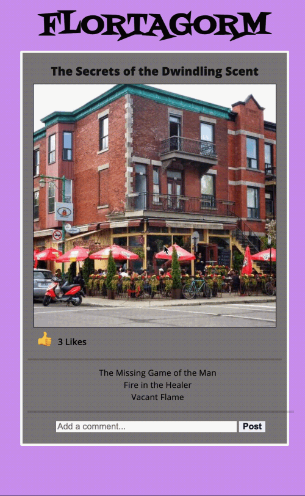

# FLORTAGORM

Today you'll be building an app for viewing, liking, and commenting on a single
picture. You will be using a remote API and building out the frontend for our
TOTALLY NEW app, FLORTAGORM.

## Setup

You will be getting your data from a remote API. Use this URL to get your unique image, likes, title, and comments:

https://distinct-vaulted-freesia.glitch.me/image 

Hit that URL in your browser to see the data, and verify that it's working for you. (If it's been a while, the server may take a second to spin up.)

Then, open the `index.html` file in your browser to load your application.

Write your code in the `src/index.js` file, using the provided data and image.

## Deliverables

As a user, I can:

1. See the image received from the server, including its title, likes and
   comments when the page loads. You will need to make a GET request to the
   following endpoint to retrieve the image data, along with its associated
   comments:

   ```txt
   // https://distinct-vaulted-freesia.glitch.me/image

   {
     "id": 437,
     "title": "The Secrets of the Dwindling Scent",
     "likes": 3,
     "image": "https://picsum.photos/id/437/500",
     "comments": [
       {
         "id": 1,
         "imageId": 437,
         "content": "The Missing Game of the Man"
       },
       {
         "id": 2,
         "imageId": 437,
         "content": "Fire in the Healer"
       },
       {
         "id": 3,
         "imageId": 437,
         "content": "Vacant Flame"
       }
     ]
   }
   ```

2. Click on the thumbs up icon to increase image likes on the page. Don't worry about saving the new likes to the database.

3. Add a new comment to the page when the comment form is submitted. Again, you don't have to save the comments to the database.

## DEMO

